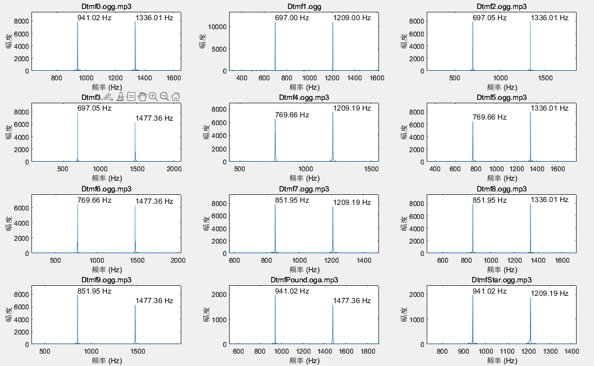

# DTMF SIGNAL，双音多频信号解析小记

> 远程启动故乡的冷盘备份

## 1 简介

上简介先：
> DTMF（Dual-tone multi-frequency）是一种用于电话系统的信号传输技术，它使用两个频率的音调信号来表示数字、字母和符号。

> DTMF信号由一个高频组合音和一个低频组合音组成，每个数字、字母和符号都有一个唯一的组合音。当用户在电话键盘上按下一个数字或字母键时，电话系统会发送相应的DTMF信号，该信号会被传输到接收方，接收方的电话系统会将信号转换为相应的数字、字母或符号。


简单地说，以前手机/电话拨号键盘用到的固定提示音就是两个频率的信号叠加得到的。通过解析音频频点，可以逆向得到按键号码。


## 2 用途

以前DTMF技术被广泛应用于电话系统中，例如自动语音应答系统、电话银行、电话会议等，这属于这个技术的原生用途。

但我们通过手机互联，也可以借助通话网络实现远程控制接入。当然，知道了解析信号的规则，也可以通过捕获环境中的按键音获知按键顺序，这就属于题外话了。

要控制就要解码，现在这种技术已经经历过淘汰浪潮，编解码技术简单易用，各种模块也非常丰富，很好上手。


如上图，我们可以通过两部手机实现远程互联。接收地的手机自动接听发送端的呼叫后，通过耳机孔输出收到的按键音信号（即DTMF信号），通过DTMF解码模块将控制投射到继电器上，达成远程控制供电合断的目的。

而像下面这种模块可以支持十几中信号组合的解码，也就能做到十几个通道的远程控制，如果增加后级对信号组合的处理，就能实现上万种控制指令。


最不济，至少，咱们能远程控制私人服务器的供电，或者在需要使用冷盘备份数据时，打一个电话，就能把千里之外的故乡的服务器启动起来，而后再通过网络接入。

## 3 原理


前面提到，拨号音就是两个单音信号再叠加一些噪声得到的双音多频信号。传统按键是0-9再加*和#一共12个按键，四行三列布局。也就是用7个单音信号就能为每个按键得到唯一双音组合。

下面是标准的组合规定：


|DTMF keypad frequencies (with sound clips)| | | |
| --- | --- | --- | --- |
| | 1209 Hz | 1336 Hz | 1477 Hz |
| 697 Hz | 1 | 2 | 3 |
| 770Hz | 4 | 5 | 6 |
| 852 Hz | 7 | 8 | 9 |
| 941 Hz | ✻ | 0 | # |


---
当然，为了更直观，可以直接看看信号波形：


再再再当然一下，啥也看不出来，对吧。本来就是频域叠加的信号，在时域当然只能看到一丢丢叠加的特征。不过至少，这些信号大致还是比较简单的，毕竟只有两个频率叠加在一起。

如果在频域下观察，就会信号特征清晰很多，下面是它们的频谱：



从频谱上看，信号的组成就一目了然了，频谱上两个极值点的横坐标正好是前面那个表里的单音信号对应的频率。

再再再再当然一下，既然叫多频信号，其他频点也不是没有信号的，只是相对于双音信号幅值可以忽略不计。看下图：


其他频点的幅值不高于20，相对于主频信号只能算是一些无所谓的燕雀之语。

## 4 分析

作为一种上古技术，分析工具和方法必然是多如牛毛的，但为了方便，最好使用matlab来做。

MathWorks官方提供了DTMF信号分析的[SIMULINK示例](https://www.mathworks.com/help/dsp/ug/dtmf-generator-and-receiver.html#d126e24440)，如下图：


洒家在这提供一个小例程，就是绘制前面那些图用到的代码：

```c
clear all;close all;

% 获取当前目录下的所有文件
files = dir('./dat');
filenum = 0;
fileList = string([]);
for i = 1:length(files)
    if files(i).isdir
        % fprintf('文件夹：%s\n', files(i).name);
    else
        fileList(filenum+1) = files(i).name;
        filenum = filenum+1;
    end
end

figure;
for i=1:12
    subplot(4,3,i)
    [y, Fs] = audioread('./dat/'+fileList(i));
    % 计算信号的频谱
    N = length(y);
    Y = fft(y);
    f = (0:N-1)*(Fs/N);
    Y = Y(1:N/2);
    
    % 绘制频谱图
    plot(f(1:length(f)/2), abs(Y));
    xlabel('频率 (Hz)');
    ylabel('幅度');
    
    % 找到频谱中的峰值
    [peaks, locs] = findpeaks(abs(Y));
    
    % 找到幅值最大的两个峰值
    [~, sortedIdx] = sort(peaks, 'descend');
    maxPeaks = peaks(sortedIdx(1:2));
    maxLocs = locs(sortedIdx(1:2));
    
    % 在图上标注频谱幅值最大的两个频点
    text(f(maxLocs(1)), maxPeaks(1), sprintf('%.2f Hz', f(maxLocs(1))), 'VerticalAlignment', 'bottom');
    text(f(maxLocs(2)), maxPeaks(2), sprintf('%.2f Hz', f(maxLocs(2))), 'VerticalAlignment', 'bottom');
    
    % 计算频谱显示区间
    maxFreq = max(f(maxLocs));
    minFreq = min(f(maxLocs));
    deltaFreq = maxFreq - minFreq;
    padding = deltaFreq * 0.8; % 添加空白边距
    xlim([minFreq - padding, maxFreq + padding]);

    maxAMP = max(maxPeaks);
    padding = maxAMP * 0.2; % 添加20%的空白边距
    ylim([0, maxAMP + padding]);


    title(fileList(i));
end
%%
figure;
for i=1:12
    subplot(4,3,i)
    [y, Fs] = audioread('./dat/'+fileList(i));
    % 计算信号的频谱
    plot(y)
    title(fileList(i));
end


```

完整的目录和音频文件放在托管仓库里了，需要的可以自行取用：[仓库链接](https://github.com/WaterCutter/DTMF)

## 5 结语

有空搞一套拨号启动的远端服务器。